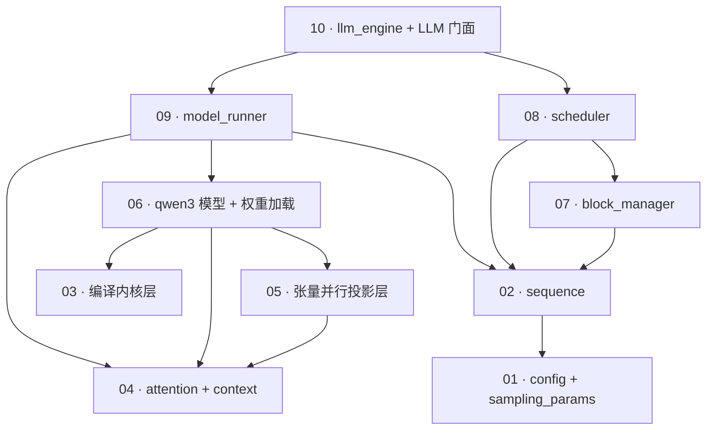

# nano-vllm 学习指南

面向初学者的仓库导读:按**模块依赖顺序**拆解这个约 1,400 行(含两个入口脚本)的轻量级 vLLM 复刻。所有讲解均以具体文件与行号为锚点;想直接动手先跳 [常用工作流](#常用工作流)。

> 本指南由 2026-09-18 的仓库快照(`doc` 分支)生成;行号引用以当时代码为准。

## 这个仓库是什么

**nano-vllm 是一个从零实现的离线 LLM 推理引擎**,只支持 Qwen3 系列模型,API 形状对齐 vLLM 的 `LLM.generate`。依据:

- `README.md`:"A lightweight vLLM implementation built from scratch",benchmark 对比 vLLM;
- [`pyproject.toml`](../../pyproject.toml):依赖仅 `torch / triton / transformers / flash-attn / xxhash`;
- 入口 [`example.py`](../../example.py)(对话生成)与 [`bench.py`](../../bench.py)(吞吐压测)。

它落地了 vLLM 的三大核心机制,各有一个"最小可读"实现:

| 机制 | 实现位置 | 学习模块 |
|---|---|---|
| 分页 KV cache(PagedAttention 数据结构侧) | [`nanovllm/engine/block_manager.py`](../../nanovllm/engine/block_manager.py) | [07](modules/07-block-manager.md) |
| 前缀缓存(prefix caching) | 同上 + [`scheduler.py:35-39`](../../nanovllm/engine/scheduler.py) | [07](modules/07-block-manager.md)、[08](modules/08-scheduler.md) |
| 连续批处理 + chunked prefill + 抢占 | [`nanovllm/engine/scheduler.py`](../../nanovllm/engine/scheduler.py) | [08](modules/08-scheduler.md) |

外加张量并行(多卡)、CUDA graph、`torch.compile` 三项工程加速(模块 [05](modules/05-tensor-parallel-layers.md)、[09](modules/09-model-runner.md)、[03](modules/03-compiled-kernels.md))。

## 模块依赖图与阅读顺序

下图中 `A --> B` 表示 **A 依赖 B**(依据 import 关系,个别运行时接线在文中标注)。因此**编号顺序就是推荐阅读顺序**:每个模块的所有依赖都排在它前面。



全图无环(纯 DAG),无需按强连通分量合并。图里看不到的一条**运行时接线**:`ModelRunner.allocate_kv_cache` 把 KV 缓存视图注入各层 `Attention`(`nanovllm/engine/model_runner.py:117-121`),import 分析发现不了,已写进模块 [09](modules/09-model-runner.md)。

## 模块索引

| # | 模块 | 文件 | 一句话 | 预计耗时 |
|---|---|---|---|---|
| [01](modules/01-config-and-sampling.md) | 配置与采样参数 | `config.py`、`sampling_params.py` | 两个 dataclass,引擎的全部输入参数 | 10 min |
| [02](modules/02-sequence.md) | Sequence | `engine/sequence.py` | 逐请求状态机,兼 TP 传输的压缩 pickle | 15 min |
| [03](modules/03-compiled-kernels.md) | 编译内核层 | `layers/{layernorm,activation,rotary_embedding,sampler}.py` | RMSNorm/SwiGLU/RoPE/采样,全部 `torch.compile` | 20 min |
| [04](modules/04-attention-and-context.md) | attention + context | `layers/attention.py`、`utils/context.py` | flash-attn 双路径 + 全局运行时元数据 | 25 min |
| [05](modules/05-tensor-parallel-layers.md) | 张量并行投影层 | `layers/{linear,embed_head}.py` | Megatron 式切分 + `weight_loader` 协议 | 25 min |
| [06](modules/06-qwen3-model.md) | Qwen3 模型 | `models/qwen3.py`、`utils/loader.py` | 手写 Qwen3 前向 + safetensors 改名加载 | 20 min |
| [07](modules/07-block-manager.md) | BlockManager | `engine/block_manager.py` | 分页 KV 记账 + 链式哈希前缀缓存 | 30 min |
| [08](modules/08-scheduler.md) | Scheduler | `engine/scheduler.py` | 调度政策:装批/chunked prefill/抢占 | 30 min |
| [09](modules/09-model-runner.md) | ModelRunner | `engine/model_runner.py` | GPU 执行器:显存预算/CUDA graph/TP 控制面 | 40 min |
| [10](modules/10-llm-engine.md) | LLMEngine + 门面 | `engine/llm_engine.py`、`llm.py`、`__init__.py` | 组装根与 `generate()` 主循环 | 15 min |

**起点是模块 01**(零依赖,且 `temperature`、`block_size` 等概念贯穿后续所有模块)。若已有 vLLM 使用经验,可从 [08 Scheduler](modules/08-scheduler.md) 直接切入,它是机制密度最高的一篇。

## 主流程走读:一次 `generate()` 的完整生命周期

把十个模块串成一条线(括号内为模块号):

1. `LLM(path, ...)` → `LLMEngine.__init__`:构造 [Config](modules/01-config-and-sampling.md)(01),spawn TP worker 进程,rank 0 构造 [ModelRunner](modules/09-model-runner.md)(09)——建 [Qwen3 模型](modules/06-qwen3-model.md)(06)、加载权重、预热、算显存预算、分配 KV 池并注入 [Attention](modules/04-attention-and-context.md)(04)、捕获 CUDA graph;再构造 [Scheduler](modules/08-scheduler.md)(08,内含 [BlockManager](modules/07-block-manager.md)(07))。
2. `llm.generate(prompts, sp)`:每个 prompt tokenize 后包成 [Sequence](modules/02-sequence.md)(02)进 `waiting` 队列(10)。
3. **每个 step**:`Scheduler.schedule()` 决定本批(08)——prefill 优先、前缀命中折算、必要时切块或抢占;`ModelRunner.run` 执行(09)——构造 flash-attn 元数据,前向经过 [并行投影层](modules/05-tensor-parallel-layers.md)(05)与 [编译内核](modules/03-compiled-kernels.md)(03),Triton kernel 把 K/V 写进分页缓存,采样出 token;`postprocess` 记账、追加 token、判定 EOS/长度结束(08)。
4. 全部序列结束后,按输入顺序 detokenize 返回 `{"text", "token_ids"}`(10)。

## 常用工作流

```bash
# 0. 环境(本仓库已带 .venv,依赖已装)
source .venv/bin/activate

# 1. 模型权重(本机已有,ModelScope 快照)
#    /home/tiger/.cache/modelscope/models/Qwen--Qwen3-0.6B/snapshots/master
#    其他环境可用:
#    huggingface-cli download Qwen/Qwen3-0.6B --local-dir ~/huggingface/Qwen3-0.6B

# 2. 最小生成(改 example.py 里的 path 为上述路径)
python example.py

# 3. 吞吐压测(默认开 CUDA graph;加 enforce_eager=True 对比)
python bench.py

# 4. 张量并行(需 ≥2 张 GPU;本机 1 卡,未验证)
python -c "
from nanovllm import LLM, SamplingParams
llm = LLM('/home/tiger/.cache/modelscope/models/Qwen--Qwen3-0.6B/snapshots/master',
           tensor_parallel_size=2, enforce_eager=True)
print(llm.generate(['你好'], SamplingParams(temperature=0.6, max_tokens=16))[0]['text'])"
```

调试建议:在 `LLMEngine.step`(`nanovllm/engine/llm_engine.py:49`)打断点,观察 `seqs`、`is_prefill` 与各 `seq.block_table` 的逐 step 变化——一条断点能同时看清模块 08/07/02 的联动。

## 端到端验证记录

本机(A800-40GB,单卡,torch CUDA 可用)已于 2026-09-18 实测:

| 验证项 | 命令/方式 | 结果 |
|---|---|---|
| 全模块 import | `.venv/bin/python -c "import ..."`(覆盖 01–10 全部顶层符号) | 通过 |
| 模型构建(模块 06 桩) | gloo 单进程建 `Qwen3ForCausalLM` | 通过,751.6M 参数(= Qwen3-0.6B 含 embedding 总量) |
| eager 推理 | `LLM(MODEL, enforce_eager=True)` + 8 token 生成 | 通过,输出 "Paris. The capital of the United States" |
| CUDA graph 推理 | `LLM(MODEL)`(默认捕获) | 通过,输出一致 |
| 前缀缓存跨请求命中 | 同一 601-token prompt 连发两次,插桩 `BlockManager.can_allocate` | 第一次 `cached_blocks=0`,第二次 `=2`(601/256 = 2 个整块,**全部命中**) |
| 文档内嵌桩代码(01/02/03/07/08) | 逐条执行各模块"验证"小节 | 通过(03 需 GPU 路径,07 需手动对齐 `Sequence.block_size`,见对应文档) |
| 张量并行 TP=2 | — | **未验证**(本机仅 1 GPU) |

## 练习

1. **热身**:跑通 `example.py`;把 `max_tokens` 改成 1,观察 tqdm 里 Prefill/Decode 吞吐的含义(模块 10)。
2. **前缀缓存**:仿照"验证记录"里的插桩脚本,把 prompt 换成只共享**前半段**的两条请求,解释为什么命中块数取整块向下取整(模块 07 的 `hash_blocks` 只登记写满的块)。
3. **chunked prefill**:把 `max_num_batched_tokens` 调到 64,发一条 600-token 的 prompt,在 `Scheduler.schedule` 打印每步的 `num_scheduled_tokens`,画出它逐 step 收敛的过程(模块 08)。
4. **CUDA graph**:在 `run_model` 打印 `input_ids.size(0)`,发不同并发数的 decode 请求,验证 batch 总是落在 `[1,2,4,8,16,32,...]` 的桶上;再解释 `slot_mapping.fill_(-1)` 的作用(模块 09 + 04)。
5. **抢占实验**:把 `gpu_memory_utilization` 压到极小(如 0.15)跑 `bench.py` 的负载,在 `Scheduler.preempt` 加计数器,观察 LIFO 抢占次数(模块 08)。
6. **(可选,多卡)** 有 ≥2 GPU 的环境跑 `tensor_parallel_size=2`,对照模块 05 的 all_reduce/gather 清单在 nccl 调用处打断点。

## 注意事项与已知边界

- **仓库无测试目录**——验证全靠 `example.py`/`bench.py` 端到端;改核心逻辑前先确保能跑通这两者。
- **`nanovllm/attention/` 目录只剩 `__pycache__`**:旧版注意力实现的字节码残留,无源码,忽略即可。
- **只支持 Qwen3 一种架构**(模块 06);换模型家族要手写新模型文件,无注册机制。
- **TP 模式的固定资源名**:NCCL 端口 `tcp://localhost:2333`、共享内存名 `"nanovllm"`,同机并行跑两个实例会冲突(模块 09)。
- **kwargs 静默过滤**、**不支持贪心解码**、**单条超长 prompt 超出 KV 池会 assert 崩溃**——分别见模块 01、03、08 的"坑"。
- **指南中的推断已标注**:如模块 08 的崩溃路径为代码走读推断、未实际触发;TP=2 未实测。行号对应当前 `doc` 分支,后续提交可能漂移。
